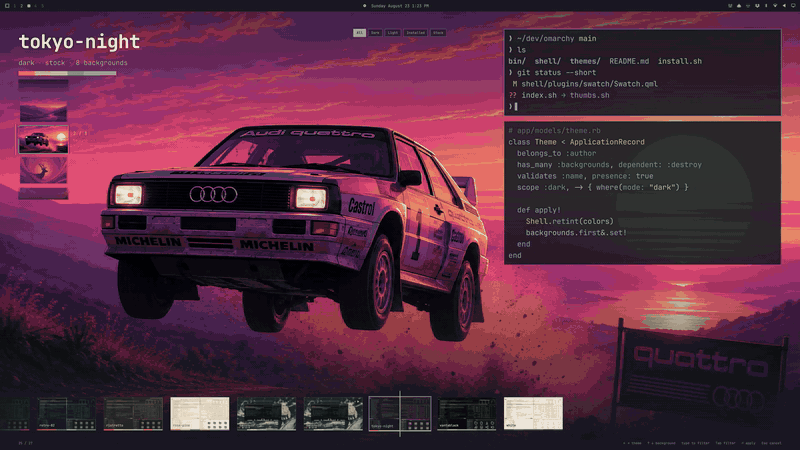

# Swatch

A theme picker for [Omarchy](https://omarchy.org) that tries the theme on.

The candidate's wallpaper fills the screen. The shell — bar, menus, notifications, the picker itself — retints to its palette as you scrub. The only chrome that isn't the theme is a filmstrip under a fixed playhead.

Built to stay instant at any collection size: an incremental index of every `colors.toml`, cards painted from the palette before any image decodes, a recycled filmstrip, and at most five screen-size wallpapers resident at once.

Plugin id `jmckible.swatch`. MIT. Not affiliated with Omarchy or 37signals.

<p align="center"></p>
<p align="center"><sub>The clip at the end previews animated backgrounds — a wallpaper with a moving version of itself (<a href="https://x.com/yamzeight/status/2089340897326469186">teaser footage by @yamzeight</a>, not included in this repo). Designed but not built: see <a href="docs/animated-backgrounds.md">docs/animated-backgrounds.md</a>. This release previews stills.</sub></p>

| Preview | Backgrounds | Filter |
|---|---|---|
| [](docs/screenshots/hero.webp) | [](docs/screenshots/backgrounds.webp) | [](docs/screenshots/filter.webp) |

## Install

```sh
omarchy plugin add https://github.com/jmckible/omarchy-swatch.git --enable
```

Then route the theme hotkey (`Super+Shift+Ctrl+Space`) and _Style > Theme_ to Swatch by adding to `~/.config/omarchy/extensions/omarchy-menu.jsonc`:

```jsonc
"style.theme": {"action": "omarchy-shell shell toggle jmckible.swatch"}
```

Remove that line to get the stock picker back. Swatch never edits your config.

Requires `jq`, `vips` and `python3` (all ship with Omarchy). Wallpaper previews are cached under `~/.cache/omarchy/swatch/` at the size of your largest monitor — roughly 1 MB per background at 1440p, 2 MB at 4K — and pruned as themes come and go.

## Keys

| Key | Action |
|---|---|
| `←` `→` | Previous / next theme |
| `↑` `↓` | Cycle the theme's backgrounds |
| `PgUp` `PgDn` `Home` `End` | Jump |
| type | Filter by name |
| `Tab` | Cycle the filter chips: All → Dark → Light → Installed → Stock (or click one) |
| `Enter` / double-click | Apply (`omarchy theme set`, plus `bg set` if you picked a background) |
| `Esc` | Clear filter, then cancel — the shell reverts |

Scroll the filmstrip with the wheel; click a card to select it.

## Scripting

`pick.sh` opens Swatch and prints the chosen theme name without applying it, the same contract as `omarchy-theme-switcher`:

```sh
theme=$(~/.config/omarchy/plugins/jmckible.swatch/pick.sh) && omarchy theme set "$theme"
```

## How it works

- `index.sh` walks `~/.config/omarchy/themes` and the stock themes, resolves each `colors.toml` through `omarchy-theme-color` (so legacy keys and aliases match what `theme set` produces), and writes `~/.cache/omarchy/swatch/index.json`. Records are reused when a theme's signature (dir mtime + `colors.toml`/`shell.toml`/preview stat) is unchanged; only changed themes are re-resolved.
- `thumbs.sh` makes, for every wallpaper the index names, a stage copy at your largest monitor's size (never upscaled) and a 640×360 filmstrip thumb. It runs on every open and does nothing when nothing is missing. The shell shows only these copies — it never opens a theme's own image file — which is also why webp wallpapers preview without `qt6-imageformats`.
- Live preview is the same call `omarchy theme set` makes over IPC (`shell applyTheme`) — shell-only, reverted on cancel, never written to disk. Terminal palettes and Hyprland borders change on apply, not during preview.
- Themes are treated as untrusted input. Every theme file the plugin reads is opened exactly once, without following symlinks, and verified on that descriptor (regular file, size ceiling, inside the theme's directory) before its bytes go anywhere; a file that grows past the ceiling is refused, not truncated. Images are decoded only from such a snapshot, single-threaded under a timeout and memory limit, at most four at a time, after a header check (loader allowlist, 50 MP). Ceilings: 32 KB TOML, 64 MB images, 200 backgrounds, 512 themes, 8 MB index. Writes go only to `~/.cache/omarchy/swatch/`, through exclusively created temp files.
- Animated backgrounds: drop `3-sunset-lake.mp4` next to `3-sunset-lake.webp` and that wallpaper moves when you rest on it. Clips are transcoded into the cache like every other derivative — the shell never plays a theme's own file — and audio is dropped. Needs `qt6-multimedia`, which Omarchy doesn't require; without it the picker shows stills and nothing else changes. See [docs/animated-backgrounds.md](docs/animated-backgrounds.md).

## Remove

```sh
omarchy plugin remove jmckible.swatch --yes
```

Then delete the `"style.theme"` line you added to `~/.config/omarchy/extensions/omarchy-menu.jsonc` to restore the stock picker, and optionally the cache at `~/.cache/omarchy/swatch/`. Swatch writes nothing else.

## Develop

```sh
ln -s "$PWD" ~/.config/omarchy/plugins/jmckible.swatch
omarchy-shell shell rescanPlugins && omarchy plugin enable jmckible.swatch
./index.sh | jq '.themes | length'
node test/model.test.js
bash test/hostile.sh      # index/thumbs against a hostile theme collection, in an isolated HOME
```

After editing QML, `omarchy restart shell`. The shell's plugin hot-reload re-mounts the cached component (the engine has no `Qt.clearComponentCache`), so edits don't land without a restart. Scripts are read fresh every open.

Bump the `echo vN` line in `sig()` whenever `resolve()`'s record shape changes; that's what invalidates cached records.
