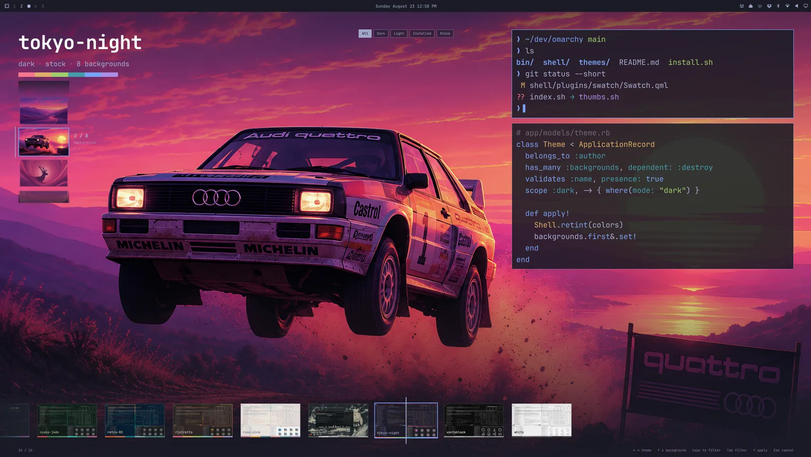
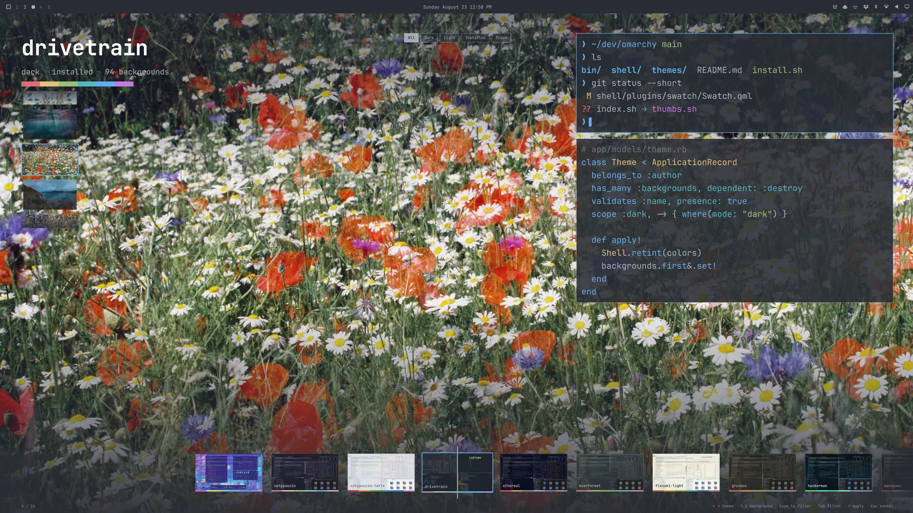
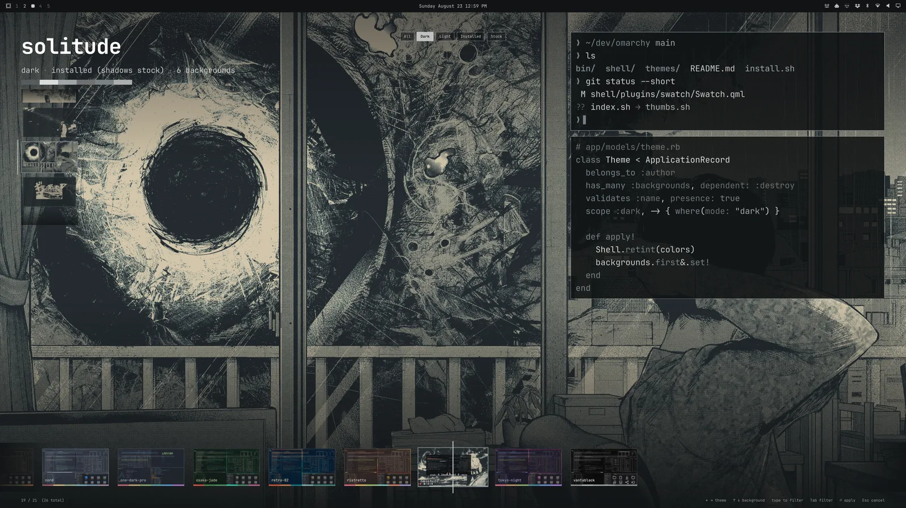

# Swatch

A theme picker for [Omarchy](https://omarchy.org) that tries the theme on.

The candidate's wallpaper fills the screen. The shell — bar, menus, notifications, the picker itself — retints to its palette as you scrub. When a theme ships a video background, it plays. The only chrome that isn't the theme is a filmstrip under a fixed playhead.

Built to stay instant at any collection size: an incremental index of every `colors.toml`, cards painted from the palette before any image decodes, a recycled filmstrip, and at most five screen-size wallpapers resident at once.

Plugin id `jmckible.swatch`. MIT. Not affiliated with Omarchy or 37signals.

<p align="center"></p>

| Backgrounds | Filter |
|---|---|
| [](docs/screenshots/backgrounds.webp) | [](docs/screenshots/filter.webp) |

## Install

```sh
omarchy plugin add https://github.com/jmckible/omarchy-swatch.git --enable
```

Then route the theme hotkey (`Super+Shift+Ctrl+Space`) and _Style > Theme_ to Swatch by adding to `~/.config/omarchy/extensions/omarchy-menu.jsonc`:

```jsonc
"style.theme": {"action": "omarchy-shell shell toggle jmckible.swatch"}
```

Remove that line to get the stock picker back. Swatch never edits your config.

Requires `jq` and `vipsthumbnail` (both ship with Omarchy). For webp backgrounds the shell needs `qt6-imageformats`.

## Keys

| Key | Action |
|---|---|
| `←` `→` | Previous / next theme |
| `↑` `↓` | Cycle the theme's backgrounds |
| `PgUp` `PgDn` `Home` `End` | Jump |
| type | Filter by name |
| `Tab` | Cycle the filter chips: All → Dark → Light → Installed → Stock (or click one) |
| `Enter` / double-click | Apply (`omarchy theme set`, plus `bg set` if you picked a background) |
| `Esc` | Clear filter, then cancel — the shell reverts |

Scroll the filmstrip with the wheel; click a card to select it.

## Scripting

`pick.sh` opens Swatch and prints the chosen theme name without applying it, the same contract as `omarchy-theme-switcher`:

```sh
theme=$(~/.config/omarchy/plugins/jmckible.swatch/pick.sh) && omarchy theme set "$theme"
```

## How it works

- `index.sh` walks `~/.config/omarchy/themes` and the stock themes, resolves each `colors.toml` through `omarchy-theme-color` (so legacy keys and aliases match what `theme set` produces), and writes `~/.cache/omarchy/swatch/index.json`. Records are reused when a theme's signature (dir mtime + `colors.toml`/`shell.toml`/preview stat) is unchanged; only changed themes are re-resolved.
- `thumbs.sh` makes 640×360 filmstrip thumbs for any record that lacks one. It runs on every open and does nothing when nothing is missing.
- Live preview is the same call `omarchy theme set` makes over IPC (`shell applyTheme`) — shell-only, reverted on cancel, never written to disk. Terminal palettes and Hyprland borders change on apply, not during preview.
- Video: the first `backgrounds/*.mp4|webm` plays muted on loop from frame 0 over the still, via the shell's own Qt Multimedia. Only the selected theme decodes video.

## Remove

```sh
omarchy plugin remove jmckible.swatch --yes
```

Then delete the `"style.theme"` line you added to `~/.config/omarchy/extensions/omarchy-menu.jsonc` to restore the stock picker, and optionally the cache at `~/.cache/omarchy/swatch/`. Swatch writes nothing else.

## Develop

```sh
ln -s "$PWD" ~/.config/omarchy/plugins/jmckible.swatch
omarchy-shell shell rescanPlugins && omarchy plugin enable jmckible.swatch
./index.sh | jq '.themes | length'
node test/model.test.js
```

After editing QML, `omarchy restart shell`. The shell's plugin hot-reload re-mounts the cached component (the engine has no `Qt.clearComponentCache`), so edits don't land without a restart. Scripts are read fresh every open.

Bump the `v2` line in `sig()` whenever `resolve()`'s record shape changes; that's what invalidates cached records.
